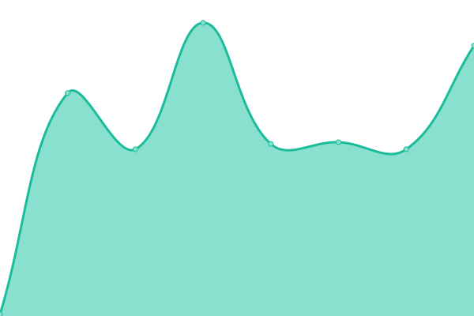

# [📈 Live Status](https://sesukaku.github.io/sesukaku.github.io): <!--live status--> **🟩 All systems operational**

This repository contains the open-source uptime monitor and status page for [sesukaku](https://sesukaku.github.io/sesukaku.github.io), powered by [Upptime](https://github.com/upptime/upptime).

With [Upptime](https://upptime.js.org), you can get your own unlimited and free uptime monitor and status page, powered entirely by a GitHub repository. We use [Issues](https://github.com/sesukaku/sesukaku.github.io/issues) as incident reports, [Actions](https://github.com/sesukaku/sesukaku.github.io/actions) as uptime monitors, and [Pages](https://sesukaku.github.io/sesukaku.github.io) for the status page.

<!--start: status pages-->
<!-- This summary is generated by Upptime (https://github.com/upptime/upptime) -->
<!-- Do not edit this manually, your changes will be overwritten -->
<!-- prettier-ignore -->
| URL | Status | History | Response Time | Uptime |
| --- | ------ | ------- | ------------- | ------ |
|  [Google](https://www.google.com) | 🟩 Up | [google.yml](https://github.com/sesukaku/sesukaku.github.io/commits/HEAD/history/google.yml) | 

 91ms
     
 | 

<a href="https://sesukaku.github.io/history/google">100.00%</a>
    

|  [Bing](https://www.bing.com) | 🟩 Up | [bing.yml](https://github.com/sesukaku/sesukaku.github.io/commits/HEAD/history/bing.yml) | 

 98ms
     
 | 

<a href="https://sesukaku.github.io/history/bing">100.00%</a>
    

|  [Yandex](https://yandex.com) | 🟩 Up | [yandex.yml](https://github.com/sesukaku/sesukaku.github.io/commits/HEAD/history/yandex.yml) | 

 742ms
     
 | 

<a href="https://sesukaku.github.io/history/yandex">100.00%</a>
    

|  [Wikipedia](https://en.wikipedia.org) | 🟩 Up | [wikipedia.yml](https://github.com/sesukaku/sesukaku.github.io/commits/HEAD/history/wikipedia.yml) | 

 311ms
     
 | 

<a href="https://sesukaku.github.io/history/wikipedia">100.00%</a>
    

|  [Hacker News](https://news.ycombinator.com) | 🟩 Up | [hacker-news.yml](https://github.com/sesukaku/sesukaku.github.io/commits/HEAD/history/hacker-news.yml) | 

 315ms
     
 | 

<a href="https://sesukaku.github.io/history/hacker-news">100.00%</a>
    

|  [Gitlab](https://gitlab.com) | 🟩 Up | [gitlab.yml](https://github.com/sesukaku/sesukaku.github.io/commits/HEAD/history/gitlab.yml) | 

 229ms
     
 | 

<a href="https://sesukaku.github.io/history/gitlab">100.00%</a>
    

|  [Bitbucket](https://bitbucket.org) | 🟩 Up | [bitbucket.yml](https://github.com/sesukaku/sesukaku.github.io/commits/HEAD/history/bitbucket.yml) | 

 281ms
     
 | 

<a href="https://sesukaku.github.io/history/bitbucket">100.00%</a>
    

|  [Gitpod](https://gitpod.io) | 🟩 Up | [gitpod.yml](https://github.com/sesukaku/sesukaku.github.io/commits/HEAD/history/gitpod.yml) | 

 128ms
     
 | 

<a href="https://sesukaku.github.io/history/gitpod">100.00%</a>
    

|  [CLBIN](https://clbin.com) | 🟩 Up | [clbin.yml](https://github.com/sesukaku/sesukaku.github.io/commits/HEAD/history/clbin.yml) | 

 214ms
     
 | 

<a href="https://sesukaku.github.io/history/clbin">100.00%</a>
    

<!--end: status pages-->

[**Visit our status website →**](https://sesukaku.github.io/sesukaku.github.io)

## 📄 License

- Powered by: [Upptime](https://github.com/upptime/upptime)
- Code: [MIT](./LICENSE) © [sesukaku](https://sesukaku.github.io/sesukaku.github.io)
- Data in the `./history` directory: [Open Database License](https://opendatacommons.org/licenses/odbl/1-0/)
